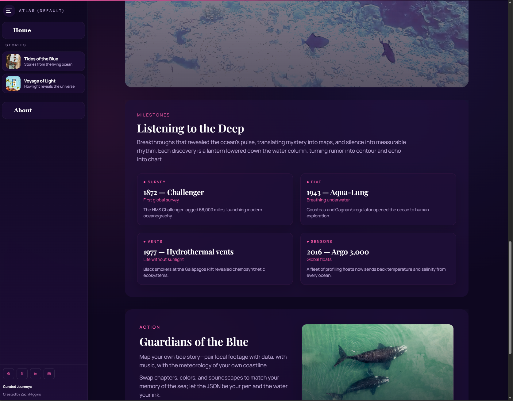

# Story Engine

JSON-driven React storytelling engine with auto-discovered stories. You supply `/content`; the engine handles routing, themes, and rendering.

## Install

Use the starter: https://github.com/Zachary-Higgins/story_app_template (preconfigured Vite + Story Engine + content folder).

Or install directly: `npm install github:Zachary-Higgins/story_app#semver:*` (latest release).

See [docs/INSTALL-FROM-GITHUB.md](docs/INSTALL-FROM-GITHUB.md) for version pinning and other options.

## Quick Start

1) Start from the template: https://github.com/Zachary-Higgins/story_app_template (pre-wired Vite config, StoryEngine usage, and content folder)
2) Add stories in `content/stories/*.json` (plugin generates `content/index.json` automatically)
3) Add media under `content/images`, `content/videos`, `content/audio`
4) Run dev/build scripts (below) and deploy your app

## Content Basics

- Story files: `content/stories/{id}.json`
- Required fields: `id`, `title`, `theme`, `pages[]`
- Layouts: `hero`, `split`, `timeline`, `immersive`
- Themes: `dark-cinematic`, `light-editorial`, `bold-gradient`

## Docs
- [docs/INSTALL-FROM-GITHUB.md](docs/INSTALL-FROM-GITHUB.md) — install & version pinning
- [docs/INTEGRATION.md](docs/INTEGRATION.md) — full setup guide
- [docs/STORY-AUTHORING.md](docs/STORY-AUTHORING.md) — schema & examples
- [CONTRIBUTING.md](CONTRIBUTING.md) — dev workflow
- [CHANGELOG.md](CHANGELOG.md) — release notes
- Template: https://github.com/Zachary-Higgins/story_app_template — ready-to-use starter

## Scripts
- `npm run dev` — local dev with sample content
- `npm run lint` — lint
- `npm test` — tests
- `npm run build:dist` — package build
- `npm run build:release` — lint + test + package build
